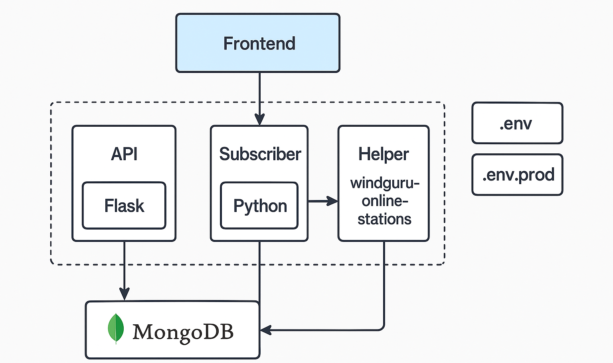

# 🌬️ tbp-wind-cuttlefish 💨
💥 Scrapper for windguru stations with API. Run as Docker Container possible.

A microservices architecture with a Python-based containerized backend (Flask, scraping, and business logic services), a Next.js frontend, and MongoDB for persistence. Backend configuration follows 12-factor principles and is tested using Pytest.

[](https://github.com/elBeato/tbp-wind-cuttlefish/actions/workflows/python-app.yml)
[](https://github.com/elBeato/tbp-wind-cuttlefish/actions/workflows/pylint.yml)
[](https://github.com/elBeato/tbp-wind-cuttlefish/actions/workflows/docker-image.yml)

# 🧰 Functions
- Call windguru api for data (on request)
- Check for online data on all windguru stations (daily)
- Send mail to subscribers depending on wind speed threshold

# Architecture
It is Microservices-Based architecture, where in the frontend
is NEXT.js and in the backend Python. 

## 🧩 Component Breakdown:
### Frontend:
Technology: Next.js (React-based framework)

Role: SSR (Server-Side Rendering), client interaction, UI rendering.

### Backend (Microservices, containerized):

#### API Container (Flask):

Acts as the public-facing REST API.

Interfaces directly with the frontend.

#### Subscriber Container:

Handles business logic.

Acts as a worker or service that communicates with external APIs (Windguru).

#### Helper Container:

Scrapes live data (online stations) and makes it available to other services.

### Database:
MongoDB (likely accessed by multiple containers, probably by the Subscriber and Helper for data persistence)


# ⚙️ Configuration
## Principal
There is the `docker-compose.yml`, `.env.prod`/`.env` and `config.yaml`. The environment
has to be defined in at least one of those files. In the `docker-compose.yml` the variables
from the `.env.prod` can be used with `${VARABLE_NAME}` or just set the value. The structure
of the `.env`-Files are: 
```
TIMES_BELOW_LIMIT=x     # x = number
TIMES_ABOVE_LIMIT=x
INTERVAL=x              #seconds, 5min = 300,
MIN_STATION_NUMBER=x
MONGO_HOST=y            # y = string
MONGO_PORT=x
MONGO_USERNAME=y
MONGO_PASSWORD=y
GOOGLE_APP_PASSWORD=y

LOG_LEVEL=x
```

# 🧑‍💻 Contribution
Warmly wellcome ... 

## Install IDE
Working with Spyder 6.0 via anaconda

## Install tests
Install Run unit test: conda install -c spyder-ide spyder-unittest
In the Run menu, select Run unit tests. If you do not see this menu item, then the plugin is not installed.
Install pytest: conda install pytest

# Run docker
Run the docker containers with the following commands

Build: ``docker compose build``

Start: ``docker compose --env-file .env.prod up -d``

Check if all containers are running: ``docker ps``